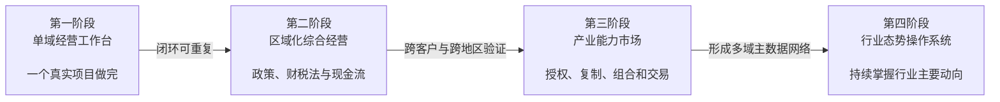
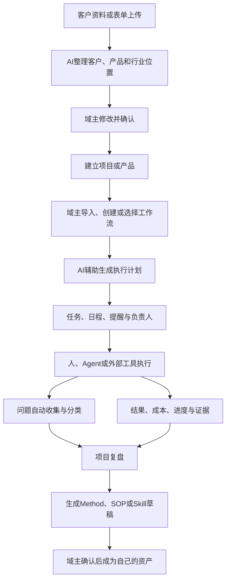
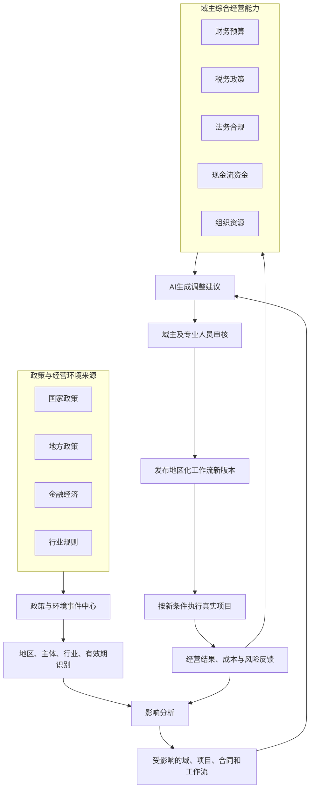
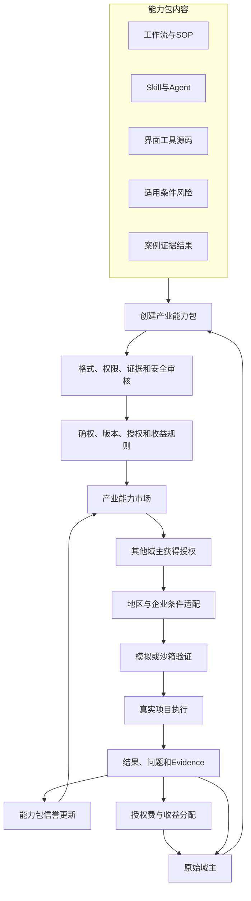
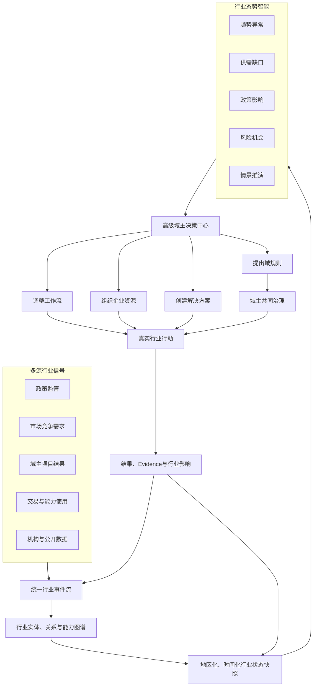
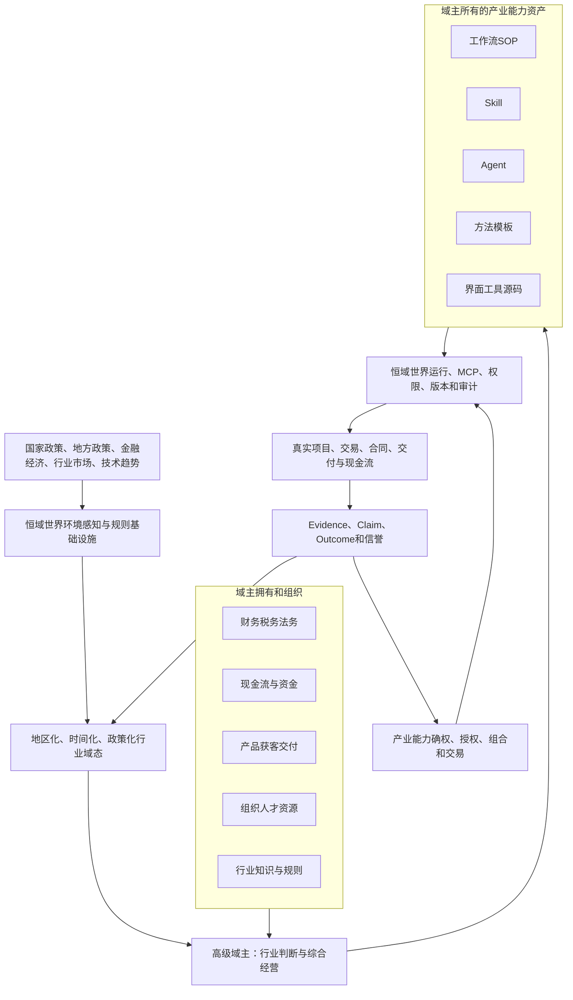
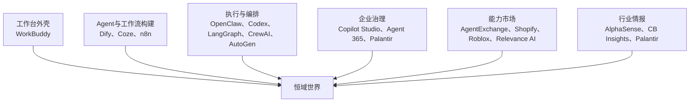

# 恒域世界 V10.6：四阶段演进架构总纲（含参考平台）

> 文档性质：恒域世界上位产品架构、阶段路线与工程边界  
> 适用项目：GEO-Industry-Engine / 恒域世界-GEO  
> 当前阶段：第一阶段——单域真实经营闭环  
> 版本日期：2026-08-10  
> 下位执行文件：`恒域世界-GEO_AI启动执行计划与问题库_Codex开发总指令_V10.5.md`  
> 核心原则：域主创造并拥有行业能力；恒域世界提供运行、连接、验证、确权、授权、交易与行业态势基础设施。

---

# 0. 本次更新结论

V10不推倒重建，升级为V10.6。

V10.5已经是一份完整的第一阶段专项开发指令，负责：

- 极简资料提交；
- AI分析与域主确认；
- 执行计划；
- 任务、提醒与进度；
- 问题解决库；
- 历史、Evidence、Outcome与Skill候选。

V10.6不覆盖V10.5，而是解决V10.5之上的五个问题：

1. 恒域世界最终发展成什么；
2. 域主与平台分别拥有什么；
3. 平台按什么阶段发展；
4. 每个阶段借鉴哪些平台；
5. 什么条件满足后才能进入下一阶段。

版本关系：

```text
V10-P0 / C6-C8：底层可信基础设施
        ↓
V10.5：第一阶段专项开发指令
        ↓
V10.6：四阶段上位演进架构总纲
        ↓
V11：第三阶段跑通并形成多域主网络后再定义
```

---

# 1. 恒域世界的准确定位

## 1.1 一句话定义

恒域世界是：

> 由域主共同建设的、能够感知国家与地区政策、行业变化和真实经营状态，帮助域主组织财税法、现金流、Agent、Skill、工作流及产业资源，并将经过验证的产业能力进行确权、复制、组合和交易的世界操作系统。

## 1.2 域不是静态行业分类

域的实时状态定义为：

```text
域态 = 行业 × 地区 × 时间 × 政策 × 金融环境 × 企业阶段 × 资源条件
```

同一个行业、同一个工作流，在不同地区、政策周期、企业阶段和资金条件下，可能产生完全不同的结果。

因此，恒域世界不能只保存“行业模板”，必须逐步保存：

- 适用国家和地区；
- 适用政策版本；
- 适用企业类型；
- 适用发展阶段；
- 所需资质和资源；
- 财务、税务和法务前置条件；
- 现金流要求；
- 风险边界；
- 有效时间；
- 已验证案例；
- 失败条件与未知范围。

## 1.3 高级域主的终局能力

高级域主不是“拥有很多工作流的人”，而是能够：

- 持续掌握行业主要动向；
- 理解国家和地区政策的影响；
- 判断金融与经济环境变化；
- 组织财务、税务、法务和现金流能力；
- 连接企业、客户、专家、机构和工具；
- 将行业方法转化为可执行工作流；
- 用真实项目验证方法；
- 将有效能力复制到其他客户、地区和行业域。

高级域主能力公式：

```text
高级域主能力
= 行业认知
× 地区政策判断
× 财税法能力
× 现金流打造
× 资源组织
× 已验证产业能力
```

域主不必本人精通全部专业。域主的综合能力包括：

```text
自身能力
+ 团队能力
+ 合作伙伴能力
+ Agent能力
+ Skill与工作流资产
+ 资源调度能力
```

---

# 2. 不可改变的所有权边界

## 2.1 域主拥有并提供

- 行业知识；
- 行业判断；
- 工作流与SOP；
- Skill；
- 行业Agent配置；
- 方法、方案和模板；
- 界面、小工具和源码；
- 获得合法授权的经营数据；
- 项目经验和问题解决方法；
- 产业能力包及其授权收益。

## 2.2 恒域世界提供

- 域主工作台；
- 身份、域、成员和权限；
- 工作流运行与版本基础设施；
- Agent运行和权限环境；
- MCP及外部工具连接；
- 项目、计划、任务、提醒和历史；
- Evidence、Claim、Outcome和可信验证；
- 政策与行业事件感知；
- 资产封装、确权和授权；
- 能力市场和收益分配；
- 行业状态图谱、快照和情景分析；
- 隐私、审计和治理。

## 2.3 平台不得做

- 不得把平台提供的通用工作流冒充域主行业方法；
- 不得未经授权占有域主工作流、Skill、源码和数据；
- 不得用AI推断制造verified事实；
- 不得未经确认替域主修改active工作流；
- 不得把某个平台或模型绑定为恒域世界唯一执行底座；
- 不得让域主因为“高级”等级获得查看其他企业隐私的权限；
- 不得把行业预测包装成确定事实。

---

# 3. 四阶段演进总图



| 阶段 | 产品目标 | 商业目标 | 参考周期 | 核心门槛 |
| --- | --- | --- | --- | --- |
| 第一阶段 | 单域真实项目闭环 | 获客、成交、交付、复购 | 0—6个月 | 一个真实域主能够重复使用 |
| 第二阶段 | 地区政策与综合经营 | 多客户、多地区复制 | 6—12个月 | 同一能力跨地区适配有效 |
| 第三阶段 | 产业能力资产化交易 | 授权费、服务费、分成 | 12—24个月 | 第三方创造并被他人采用 |
| 第四阶段 | 行业态势与产业协同 | 行业情报、数据服务、生态服务 | 24—36个月以上 | 多域主持续产生可信行业信号 |

时间只作参考。阶段升级依据真实验收门槛，不依据日期。

---

# 4. 第一阶段：单域经营工作台

## 4.1 阶段目标

聚焦：

- 一个垂直赛道；
- 一个真实域主；
- 一个核心产品；
- 一类目标客户；
- 一个主要转化目标；
- 一条可重复经营闭环。

第一阶段只证明：

> 域主可以把资料、方法和资源交给恒域世界，通过AI辅助完成定位、计划、执行、问题处理、结果验证和经验沉淀。

## 4.2 第一阶段用户路径



## 4.3 第一阶段必须建设

### 用户界面

只保留六个主要入口：

| 入口 | 内容 |
| --- | --- |
| 今日工作 | 待办、提醒、AI建议、阻塞和风险 |
| 客户与定位 | 表单上传、资料分析、域主确认 |
| 项目与计划 | 项目、阶段、步骤、任务、进度 |
| 执行与问题 | 单步骤执行、问题库、尝试和纠偏 |
| 结果与资产 | Evidence、Outcome、复盘、Skill候选 |
| 工具与连接 | MCP、Codex、OpenClaw、本地工具和外部服务 |

### 业务能力

- 极简资料提交；
- AI结构化分析；
- 域主确认；
- 项目与产品创建；
- 域主工作流导入、编辑和版本；
- AI执行计划；
- 任务、提醒和进度；
- 问题收集整理库；
- SolutionAttempt与Correction；
- Evidence、Claim和Outcome；
- 项目复盘；
- Skill候选；
- 本地源码和工具连接。

### 数据要求

- AI提取默认为draft、observed或inferred；
- completed不自动提高信誉；
- Outcome不自动制造Evidence；
- 每次Agent和工具运行保存输入、输出、版本、引用和成本；
- 失败、阻塞和无Key状态必须真实保留；
- 问题Occurrence不能因聚类而删除。

## 4.4 第一阶段如何做

1. 复用V10-P0、C6-C8和V10.5已有协议；
2. 不再增加平行Task、Evidence、Outcome和Reputation体系；
3. 前端采用WorkBuddy式“对话＋任务＋工作面”壳；
4. AI先整理，域主只确认关键差异；
5. 工作流归域主，平台负责运行和审计；
6. 只接入少量高频工具；
7. 本地源码继续保存在域主环境或授权仓库；
8. 用真实试点数据替代更多模拟模型。

## 4.5 第一阶段参考平台

| 参考平台 | 借鉴内容 | 不照搬内容 |
| --- | --- | --- |
| WorkBuddy | 人性化AI工作台、Projects、Experts、Skills、Connectors | 不把平台专家当作行业域主，不停留在个人办公助手 |
| Dify | Agent、Workflow、Tool、MCP、插件和私有集成 | 不把恒域世界做成通用AI应用开发平台 |
| n8n | 用户拥有工作流、可视化执行、历史、MCP和自托管 | 不把节点编排器直接暴露给普通域主 |
| OpenClaw | 本地Agent、Skill、浏览器和工具执行 | 不作为恒域世界核心架构，不直接信任第三方Skill |
| Codex | 源码生成、修改、测试、工具和界面开发 | 不作为业务真相源，不自动发布生产变更 |
| Coze | Agent与Workflow模板、资源库和Store体验 | 不采用封闭平台所有权和单纯模板复制模式 |

## 4.6 第一阶段验收门槛

- 一个真实域主完成端到端项目；
- 同一工作流在第二个项目中复用；
- 问题自动进入问题库；
- 结果绑定真实Evidence；
- 产生一份域主确认的Skill或Method资产；
- 域主愿意继续使用；
- 无AI Key、外部工具失败和网络中断都有真实降级。

## 4.7 第一阶段禁止提前做

- 公开Skill交易市场；
- 全行业预测大屏；
- 全国政策实时知识图谱；
- 完整ERP、CRM或财税软件；
- 复杂甘特图和多维表；
- 完整飞书复制；
- 大量没有真实数据来源的新模型。

---

# 5. 第二阶段：区域化综合经营平台

## 5.1 阶段目标

让同一行业方法能够根据以下条件安全变化：

- 国家政策；
- 省、市、区县政策；
- 行业监管和标准；
- 利率、信贷和金融环境；
- 企业主体类型；
- 企业发展阶段；
- 财务、税务和法务条件；
- 现金流和资源约束。

## 5.2 第二阶段架构



## 5.3 第二阶段必须建设

- 政策来源白名单；
- 国家与地方政策事件；
- jurisdiction和有效期；
- 政策适用主体与行业；
- 政策变更影响范围；
- 工作流适用范围；
- 地区化工作流版本；
- 项目预算和利润；
- 回款、付款、现金储备和现金流预警；
- 财税法检查清单；
- 专业服务商连接；
- 情景比较；
- 高风险事项人工确认。

## 5.4 工作流第二阶段元数据

```text
applicable_industry
applicable_region
applicable_entity_type
applicable_stage
policy_version
valid_from
valid_to
prerequisites
license_requirements
tax_conditions
legal_constraints
cashflow_requirements
risk_boundary
validated_cases
failed_conditions
```

## 5.5 第二阶段如何做

```text
发现政策变化
→ 核验官方来源
→ 提取适用地区、主体和时间
→ 定位受影响的域、项目和工作流
→ AI生成影响说明与修改建议
→ 域主或专业人员确认
→ 创建新版本
→ 更新计划但不覆盖历史
→ 真实执行并回填结果
```

涉及法律、税务、融资和重大现金流决策时，AI只能辅助，不得替代专业人员或域主审批。

## 5.6 第二阶段参考平台

| 参考平台 | 借鉴内容 | 不照搬内容 |
| --- | --- | --- |
| Microsoft Copilot Studio / Agent 365 | Agent身份、权限、数据策略、审计、风险控制、MCP治理 | 不绑定Microsoft租户和Power Platform作为唯一世界边界 |
| Palantir Ontology / AIP | 数据、逻辑、行动、安全和对象关系统一；Human+AI决策 | 不做高成本、重实施、单一大客户式平台 |
| n8n | 确定性流程、人工审批、连接器、版本和执行历史 | 不将财税法判断简化为自动节点 |
| Dify | 外部模型、工具、数据源和私有集成 | 不把政策事实仅放入普通知识库RAG |
| LangGraph | 可控、有状态、可恢复、Human-in-the-loop的Agent编排 | 只作为内部执行参考，不成为产品定位 |
| CrewAI | Agent团队和Flow组合、角色与任务分工 | 不用多个Agent模拟真实专业资质 |
| AutoGen | 事件驱动、多Agent和MCP扩展思路 | 不在第一阶段引入新的重型Agent框架 |

## 5.7 第二阶段验收门槛

- 同一能力适配多个真实客户；
- 至少能区分两个地区的政策和适用条件；
- 政策变化能够定位受影响对象；
- 地区化工作流版本有真实执行结果；
- 项目能够记录预算、利润、回款和现金流；
- 域主能够组织真实财税法专业资源；
- 高风险建议存在人工确认和审计。

---

# 6. 第三阶段：域主产业能力市场

## 6.1 阶段目标

把经过真实项目验证的域主能力封装为“产业能力包”，使其他域主能够：

```text
发现
→ 评估
→ 获得授权
→ 按地区和企业条件适配
→ 沙箱验证
→ 执行
→ 回传结果
→ 贡献改进
```

原始域主获得授权收益、反馈和信誉积累。

## 6.2 第三阶段架构



## 6.3 产业能力包标准

至少包含：

- 工作流与SOP；
- Skill；
- Agent配置；
- Prompt和规则；
- Tool与MCP依赖；
- 界面、组件或源码；
- 输入输出协议；
- 适用地区和政策；
- 企业阶段与前置条件；
- 完成标准；
- 风险和失败模式；
- 真实案例；
- Evidence与Outcome；
- 权属和来源；
- 授权方式；
- 收益分配；
- 版本和更新记录；
- 数据许可和隐私范围。

## 6.4 第三阶段信誉原则

不能主要依赖点赞和营销文案，应依赖：

- 真实使用次数；
- 使用地区和企业条件；
- 成功、失败和异常结果；
- Evidence完整度；
- 复制后有效性；
- 版本维护情况；
- 使用方反馈；
- 数据和权限合规情况。

## 6.5 第三阶段参考平台

| 参考平台 | 借鉴内容 | 不照搬内容 |
| --- | --- | --- |
| Salesforce AgentExchange | Action、Prompt、Topic、Agent Template的封装、审核、发现、试用、购买和行业方案市场 | 不封闭在CRM生态，不让平台拥有行业能力 |
| Shopify App Store | 平台提供基础能力，第三方开发者提供扩展；公开和定向分发 | 不把能力包简化为软件插件，不忽视服务和人力交付 |
| Roblox Creator Store | 创作者资产复用、分发、销售和创作者收益 | 不游戏化虚构经营结果，不把产业资产变成纯数字物品 |
| Relevance AI Marketplace | Agent、Tool和Workforce的创作者市场和一键克隆 | 不只交易Agent模板，必须绑定适用条件和Evidence |
| Coze Store | 低门槛发布、发现、复制和配置 | 不采用无验证的大规模模板堆积 |
| Dify Marketplace | 插件打包、版本、私有安装和公开发布 | 不把产业能力等同于技术插件 |
| n8n Creator/Templates | 用户贡献工作流、创作者身份和模板复用 | 不鼓励脱离客户条件的JSON复制 |
| OpenClaw / ClawHub | Skill目录、安装、版本和验证思路 | 第三方Skill必须沙箱、扫描、权限和人工审核，不能直接信任 |

## 6.6 第三阶段验收门槛

- 第三方域主发布自己的能力包；
- 另一位域主获得授权并完成适配；
- 复制后产生真实执行结果；
- 失败和不适用案例被保留；
- 权属、版本、授权和收益分配跑通；
- 能力包能够升级但不覆盖历史；
- 形成持续贡献而不是一次性模板下载。

---

# 7. 第四阶段：行业态势与产业能力操作系统

## 7.1 阶段目标

当多个地区、多个域主、多个项目和能力包持续产生可信数据后，系统形成：

> 行业现在发生什么、为什么发生、影响哪些主体、哪里存在机会和风险、下一步可以采取什么行动。

“掌握行业所有动向”必须解释为：

> 掌握行业内可观测、可授权、可验证且与决策有关的主要动向，同时明确未知范围和数据缺口。

## 7.2 第四阶段架构



## 7.3 第四阶段必须建设

- 行业实体和关系图谱；
- 政策、需求、供给、竞争、资本、人才和技术事件；
- 实时或准实时行业事件流；
- World State Snapshot；
- 数据覆盖和未知区域；
- 趋势、异常和缺口；
- 政策影响分析；
- 情景推演；
- 域主资源组织；
- 域主共同治理；
- 企业、机构和政府数据服务；
- API与可信行业报告。

## 7.4 数据等级

| 数据等级 | 来源 | 允许用途 |
| --- | --- | --- |
| 公开数据 | 政府、机构、企业公开资料 | 行业观察和政策分析 |
| 授权数据 | 企业、域主和合作方授权 | 按授权范围使用 |
| 项目数据 | 真实执行产生 | 验证方法和结果 |
| 交易数据 | 能力包授权与使用 | 供需、能力和复制分析 |
| 推断数据 | AI分析或模型预测 | 必须标记为inferred |
| 未知数据 | 尚未覆盖 | 明确显示缺口，不得补造 |

## 7.5 第四阶段参考平台

| 参考平台 | 借鉴内容 | 不照搬内容 |
| --- | --- | --- |
| Palantir Foundry / Ontology / AIP | 对象、关系、数据、逻辑、行动、安全、MCP和Human+AI协同的统一现实层 | 不采用单企业、重顾问、高成本封闭实施模式 |
| AlphaSense | 公司、主题、研究资料和市场信息的搜索、监测与情报工作流 | 不把公开文档搜索等同于真实行业状态 |
| CB Insights | 公司、市场、竞争、资本和趋势信号 | 不把商业数据库覆盖度当作行业全部现实 |
| Microsoft Agent 365 | Agent身份、集中治理、可观测性和策略控制 | 不把行业域锁定在单一企业租户 |
| Salesforce Data/Trust体系 | 企业数据、工作流、Audit Trail和可信Agent行动 | 不只观察CRM内部世界 |
| Shopify生态 | 商户经营数据和第三方应用形成生态反馈 | 不把行业域等同于店铺经营系统 |
| Roblox创作者生态 | 大量创作者持续产生世界和资产形成网络效应 | 不采用虚拟世界规则替代现实法律和产业规则 |

## 7.6 第四阶段验收门槛

- 多个地区域主持续贡献真实结果；
- 行业主体和关系持续更新；
- 政策变化能够进入行业状态；
- 行业判断可以追溯到Evidence；
- 系统显示覆盖率、置信度和未知区域；
- 域主据此调整经营并产生真实反馈；
- 行业数据产品对真实决策有持续价值。

---

# 8. 恒域世界终局总体架构



---

# 9. 参考平台全景与恒域世界的关系

## 9.1 总体判断

目前没有一个平台与恒域世界完整一致。

恒域世界借鉴的是不同平台的不同层：



这些平台只能作为模块参考，不得成为恒域世界的单一依赖或总体定位。

## 9.2 全部参考平台清单

| 平台 | 类型 | 对应阶段 | 重点借鉴 | 恒域世界必须超越的地方 |
| --- | --- | --- | --- | --- |
| [WorkBuddy](https://www.workbuddy.ai/) | AI工作台 | 第一阶段 | Projects、Experts、Skills、Connectors和自然语言完成工作 | 从个人办公升级为域主产业经营 |
| [Dify](https://docs.dify.ai/en/self-host/use-dify/workspace/plugins) | AI应用与Agent平台 | 第一、二阶段 | Workflow、Agent、Tool、MCP、插件、私有集成 | 增加域权、Evidence、政策适用性和资产交易 |
| [n8n](https://docs.n8n.io/connect/connect-to-n8n-mcp-server) | 工作流自动化 | 第一、二阶段 | 用户工作流、自托管、MCP、历史、人工确认、模板 | 普通域主无需面对复杂节点；增加行业语义与可信结果 |
| [Coze](https://www.coze.com/open/docs/guides/store) | Agent与Workflow平台 | 第一、三阶段 | 无代码构建、模板、资源库和Store | 增加域主所有权、适用条件、证据和收益规则 |
| [Microsoft Copilot Studio](https://learn.microsoft.com/en-us/microsoft-copilot-studio/agent-extend-action-mcp) | 企业Agent平台 | 第二、三阶段 | MCP、Agent Flow、连接器、企业权限 | 跨企业、跨地区和跨行业域开放 |
| [Microsoft Agent 365治理](https://learn.microsoft.com/en-us/microsoft-copilot-studio/security-and-governance) | Agent治理控制面 | 第二、四阶段 | Agent身份、数据策略、审计和风险控制 | 域主共同治理而非单租户管理员治理 |
| [Salesforce AgentExchange](https://www.salesforce.com/agentforce/agentexchange/) | Agent能力市场 | 第三阶段 | Action、Topic、Prompt、Agent Template、审核、购买和变现 | 不锁定CRM；交易完整产业能力包和真实结果 |
| [Relevance AI Marketplace](https://marketplace.relevanceai.com/) | Agent与Workforce市场 | 第三阶段 | 创作者、Agent、Tool、Workforce和一键部署 | 能力必须绑定政策、地区、Evidence和适用条件 |
| [Palantir Ontology](https://www.palantir.com/platforms/ontology/) | 企业现实与决策层 | 第二、四阶段 | 数据、逻辑、行动、安全、对象关系、工具和MCP统一 | 从单组织现实扩展到多域主产业共同现实 |
| [AlphaSense](https://www.alpha-sense.com/solutions/market-intelligence-platform/) | 市场情报 | 第四阶段 | 公司、研究、竞争和主题监测 | 与真实项目、Outcome和域主行动形成闭环 |
| [CB Insights](https://www.cbinsights.com/) | 公司与市场情报 | 第四阶段 | 公司、资本、市场、趋势和预测信号 | 加入政策、地区、交易、执行和真实结果 |
| [OpenClaw](https://docs.openclaw.ai/skills) | 本地Agent与Skill运行 | 第一、二阶段 | 本地运行、Skill、工具、浏览器和MCP | 必须沙箱、权限、验证；只作为执行工具层 |
| [Codex](https://openai.com/codex/) | 软件工程Agent | 第一至三阶段 | 源码、界面、工具、测试、Skills和多Agent开发 | 只负责开发和执行，不拥有行业数据与决策权 |
| [LangGraph](https://www.langchain.com/langgraph) | Agent编排框架 | 第二阶段 | 有状态、持久化、可控和Human-in-the-loop | 作为内部可替换引擎，不成为产品中心 |
| [CrewAI](https://docs.crewai.com/) | 多Agent与Flow框架 | 第二阶段 | Agent团队、Flow、任务和角色协同 | 不能用Agent角色冒充真实专业责任主体 |
| [AutoGen](https://microsoft.github.io/autogen/stable/index.html) | 多Agent框架 | 第二阶段 | 事件驱动、多Agent、扩展和MCP | 仅在真实需求出现时采用，避免框架叠加 |
| [Shopify App Store](https://shopify.dev/docs/apps/launch/distribution/select-distribution-method) | 商户与开发者生态 | 第三阶段 | 平台基础设施、第三方能力、公开与定向分发 | 产业能力不仅是App，还包括人、方法、数据和服务 |
| [Roblox Creator Store](https://create.roblox.com/docs/production/creator-store) | 创作者资产市场 | 第三阶段 | 创作者资产复用、销售和生态网络效应 | 必须遵守现实政策、Evidence和产业责任边界 |
| [MCP](https://modelcontextprotocol.io/) | 开放连接协议 | 全阶段 | Tools、Resources、Prompts和可替换连接 | MCP只是连接层，不是业务、工作流或可信资产本身 |

---

# 10. 技术采用策略

## 10.1 不把外部平台整体塞入核心

正确方式：

```text
恒域世界业务协议层
        ↓
内部最小运行接口
        ↓
Adapter / MCP / API
        ↓
Dify / n8n / OpenClaw / Codex / 其他工具
```

错误方式：

```text
恒域世界 = Dify二次开发
恒域世界 = n8n换皮
恒域世界 = OpenClaw外壳
恒域世界 = WorkBuddy复制
```

## 10.2 平台必须拥有的最小核心

- Realm身份与权限；
- 域主资产权属；
- Project、Plan、Work Item；
- Workflow引用和版本；
- Agent/Tool Execution记录；
- Evidence、Claim、Outcome；
- Event和Audit；
- World Contract与World State；
- Policy/Event适用性；
- Capability Package；
- License与收益规则。

## 10.3 可以外接或替换

- LLM模型；
- Agent执行框架；
- 工作流执行器；
- 浏览器自动化；
- 代码生成工具；
- 文件和知识库；
- 邮件、日历、表格和协同工具；
- 数据供应商；
- 发布和监测工具；
- 财税法专业软件。

## 10.4 本地源码原则

- 域主创建的界面和工具可以保存在本地或授权仓库；
- 平台保存项目引用、版本、hash、授权和运行记录；
- 未经授权不复制私有源码；
- 能力包交易时明确源码是否包含、是否托管、是否可修改；
- Codex和其他开发Agent通过受控工作区执行。

---

# 11. 各阶段前端开放策略

| 导航/页面 | 第一阶段 | 第二阶段 | 第三阶段 | 第四阶段 |
| --- | --- | --- | --- | --- |
| 今日工作 | 开放 | 增强 | 增强 | 态势驱动 |
| 客户与定位 | 开放 | 地区化 | 能力匹配 | 行业需求网络 |
| 项目与计划 | 开放 | 政策适配 | 跨组织执行 | 行业行动组合 |
| 执行与问题 | 开放 | 财税法与风险 | 跨域反馈 | 行业问题图谱 |
| 结果与资产 | 开放 | 地区验证 | 能力包 | 行业可信资产 |
| 工具与连接 | 开放 | MCP治理 | 市场依赖 | 行业工具网络 |
| 政策与经营 | 隐藏 | 开放 | 增强 | 态势融合 |
| 能力市场 | 隐藏 | 内部准备 | 开放 | 生态分发 |
| 行业态势 | 隐藏 | 局部观察 | 网络观察 | 正式开放 |
| 共同治理 | 隐藏 | 预留 | 试点 | 开放 |

通过Feature Flag控制阶段能力，不删除后续基础代码，也不让第一阶段用户看到空壳页面。

---

# 12. 数据模型演进原则

## 12.1 第一阶段复用优先

- Realm / Entity；
- node_memberships；
- GEO Project；
- Work Item；
- SOPTemplate / SOPRun / StepRun或等价结构；
- Agent Run / Tool Execution；
- Artifact；
- Evidence / EvidenceClaim；
- Outcome；
- Event Backbone / AuditLog；
- Memory；
- Reminder；
- ProblemOccurrence / SolutionAttempt；
- SkillCandidate。

## 12.2 第二阶段最小新增

仅在现有结构无法表达时增加：

- Jurisdiction；
- PolicySource；
- PolicyEvent；
- ApplicabilityRule；
- WorkflowApplicability；
- PolicyImpact；
- BusinessFinancialSnapshot；
- CashflowSnapshot；
- ProfessionalReview。

## 12.3 第三阶段最小新增

- CapabilityPackage；
- CapabilityPackageVersion；
- LicenseTerm；
- Grant / Entitlement；
- MarketplaceListing；
- Installation / Adaptation；
- UsageOutcome；
- RevenueShareEvent。

## 12.4 第四阶段最小新增

- IndustryEvent；
- IndustryEntityBinding；
- StateSnapshot扩展；
- CoverageGap；
- TrendSignal；
- Scenario；
- GovernanceProposal；
- CollectiveDecision。

每次新增模型前必须回答：

1. 现有模型为什么不能表达；
2. 谁是数据所有者；
3. 谁可以读写；
4. 数据来源和可信级别是什么；
5. 是否存在版本和有效期；
6. 是否会跨Realm泄露；
7. 是否能安全迁移和回滚。

---

# 13. 阶段升级门

## 13.1 第一阶段进入第二阶段

- [ ] 真实域主完成完整项目；
- [ ] 工作流重复使用；
- [ ] 结果绑定Evidence；
- [ ] 问题和失败得到沉淀；
- [ ] 产生域主确认的Skill候选；
- [ ] 用户愿意持续使用。

## 13.2 第二阶段进入第三阶段

- [ ] 多客户真实验证；
- [ ] 至少两个地区完成适配；
- [ ] 政策影响链可追溯；
- [ ] 财税法高风险事项有人审；
- [ ] 现金流数据进入项目复盘；
- [ ] 能力包适用条件已经稳定。

## 13.3 第三阶段进入第四阶段

- [ ] 第三方域主贡献资产；
- [ ] 其他域主获得授权并执行；
- [ ] 收益分配跑通；
- [ ] 复制结果持续回传；
- [ ] 多地区、多项目形成事件网络；
- [ ] 数据覆盖足以支持行业判断。

---

# 14. V10.6对现有V10代码的改造原则

## 14.1 保留

- 现有Realm统一身份链；
- 认领状态机；
- node_memberships权限真相源；
- 现有Project、Work Item、Artifact和Outcome；
- Evidence与Trust Foundation；
- Demand、Connection和World Contract；
- World State Snapshot；
- Agent、Tool、Memory、Citation和执行记录；
- 原有旧页面与API兼容层。

## 14.2 定向修改

1. 明确workflow、Skill、Agent配置和工具资产归属；
2. 将第一阶段主导航收口为六个入口；
3. 后续阶段页面使用Feature Flag隐藏；
4. 工作流增加owner、source、version和authorization；
5. 完成资料—定位—项目—计划—执行—问题—结果—资产闭环；
6. 把V10.5作为第一阶段唯一执行指令；
7. 为第二阶段只预留接口，不提前扩建空模型；
8. 所有外部平台通过Adapter、MCP或API接入。

## 14.3 禁止

- 不删除现有可信基础设施；
- 不建立第二套路由、权限和数据模型；
- 不把Dify、n8n或OpenClaw嵌入成不可替换核心；
- 不提前建设完整Marketplace；
- 不提前实现全国政策预测系统；
- 不用模拟数据宣称进入第二、三、四阶段；
- 不因页面简化而删除底层历史和证据能力。

---

# 15. Codex执行顺序

## Phase A：只读审计与版本对齐

- 读取V10.5和V10.6；
- 读取适用AGENTS.md；
- 审计现有模型、API、路由、页面和测试；
- 输出“保留、复用、隐藏、修改、暂缓”五类清单；
- 明确当前处于第一阶段；
- 不立即新增迁移。

## Phase B：权属与Feature Flag

- 核验workflow、Skill、Agent、Tool的owner与source；
- 核验Realm隔离；
- 增加四阶段Feature Flag或等价配置；
- 隐藏后续阶段空壳入口；
- 保留后端协议。

## Phase C：执行V10.5第一阶段闭环

严格按照V10.5完成：

```text
极简资料提交
→ AI分析
→ 域主确认
→ 建立项目
→ 域主工作流
→ 执行计划
→ 任务提醒
→ 问题解决库
→ 结果Evidence
→ 项目复盘
→ Skill候选
```

## Phase D：真实试点验收

- 使用真实域主和真实项目；
- 不伪造AI、政策、经营和验证数据；
- 记录阻塞；
- 完成第二次复用；
- 通过第一阶段升级门后，再编写第二阶段PRD。

---

# 16. 给Codex的直接更新指令

```text
执行《恒域世界 V10.6：四阶段演进架构总纲（含参考平台）》：

1. V10.6是上位架构，V10.5是第一阶段专项开发指令，二者不得互相覆盖；
2. 当前只实施第一阶段“单域真实经营闭环”，不得提前实现第二至第四阶段完整功能；
3. 域主拥有并提供行业工作流、Skill、Agent配置、方法、界面、工具和源码；恒域世界只提供运行、连接、验证、版本、确权、授权、交易和行业态势基础设施；
4. 保留现有Realm、Membership、Project、Work Item、Artifact、Evidence、Claim、Outcome、Trust、Demand、Connection、World Contract和World State；
5. 审计现有实现后，输出保留、复用、隐藏、修改、暂缓清单；
6. 使用Feature Flag隐藏政策经营、能力市场、行业态势和共同治理等后续阶段入口，不删除底层协议；
7. 所有外部平台只通过Adapter、MCP或API接入，Dify、n8n、OpenClaw、Codex、LangGraph、CrewAI或AutoGen都不得成为不可替换核心；
8. 前端优先借鉴WorkBuddy的人性化工作台；工作流运行参考n8n和Dify；治理参考Copilot Studio与Palantir；市场参考AgentExchange、Shopify和Roblox；行业情报参考AlphaSense和CB Insights；
9. 不建立第二套Task、Evidence、Outcome、Reputation、权限或路由体系；
10. 第一阶段通过真实域主、真实项目、重复工作流、真实Evidence和Skill候选验收后，停止并提交升级门报告，不自动进入第二阶段。
```

---

# 17. 参考资料

以下为本版架构核验使用的官方或产品资料，功能可能继续变化，实施前应再次核验：

- [WorkBuddy](https://www.workbuddy.ai/)
- [Dify Integrations](https://docs.dify.ai/en/self-host/use-dify/workspace/plugins)
- [n8n MCP](https://docs.n8n.io/connect/connect-to-n8n-mcp-server)
- [n8n Workflow Templates](https://n8n.io/workflows/)
- [Coze Store](https://www.coze.com/open/docs/guides/store)
- [Microsoft Copilot Studio MCP](https://learn.microsoft.com/en-us/microsoft-copilot-studio/agent-extend-action-mcp)
- [Microsoft Copilot Studio Security and Governance](https://learn.microsoft.com/en-us/microsoft-copilot-studio/security-and-governance)
- [Salesforce AgentExchange](https://www.salesforce.com/agentforce/agentexchange/)
- [Relevance AI Marketplace](https://marketplace.relevanceai.com/)
- [Palantir Ontology](https://www.palantir.com/platforms/ontology/)
- [AlphaSense Market Intelligence](https://www.alpha-sense.com/solutions/market-intelligence-platform/)
- [CB Insights](https://www.cbinsights.com/)
- [OpenClaw Skills](https://docs.openclaw.ai/skills)
- [OpenClaw MCP](https://docs.openclaw.ai/cli/mcp)
- [OpenAI Codex](https://openai.com/codex/)
- [LangGraph](https://www.langchain.com/langgraph)
- [CrewAI Documentation](https://docs.crewai.com/)
- [Microsoft AutoGen](https://microsoft.github.io/autogen/stable/index.html)
- [Shopify App Distribution](https://shopify.dev/docs/apps/launch/distribution/select-distribution-method)
- [Roblox Creator Store](https://create.roblox.com/docs/production/creator-store)
- [Model Context Protocol](https://modelcontextprotocol.io/)

---

# 18. 最终冻结结论

恒域世界的发展顺序冻结为：

```text
第一阶段：域主把真实工作做完
第二阶段：域主在不同地区和政策下把企业经营好
第三阶段：域主把经过验证的产业能力复制和交易
第四阶段：高级域主共同形成持续更新的行业现实
```

恒域世界的核心不是拥有域主的工作流，而是：

> 让域主的行业能力在真实政策、地区和经营环境中被创建、运行、验证、确权、组合、复制、交易和持续演化。

